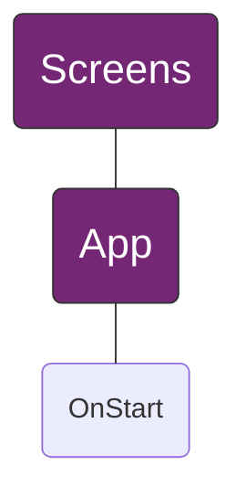
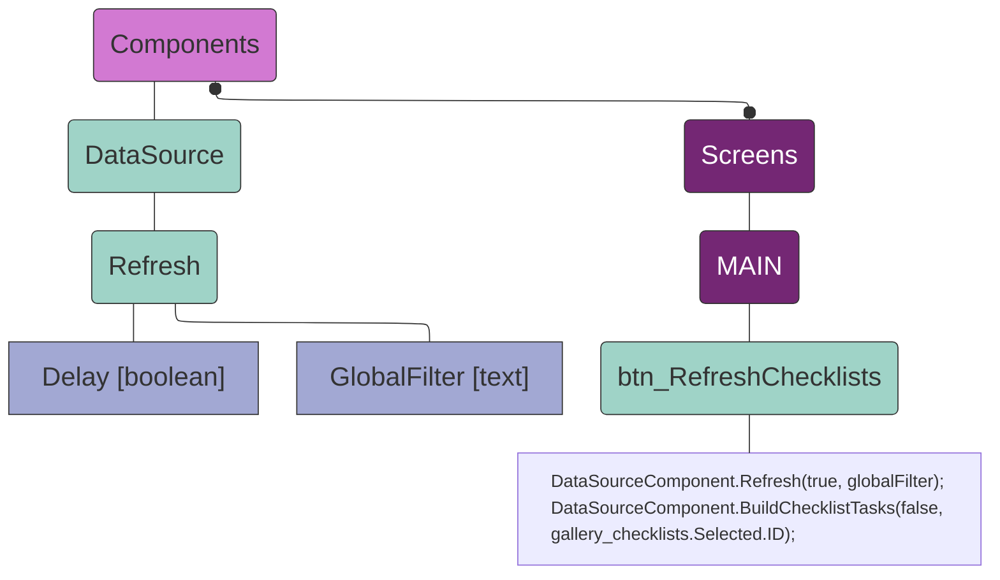
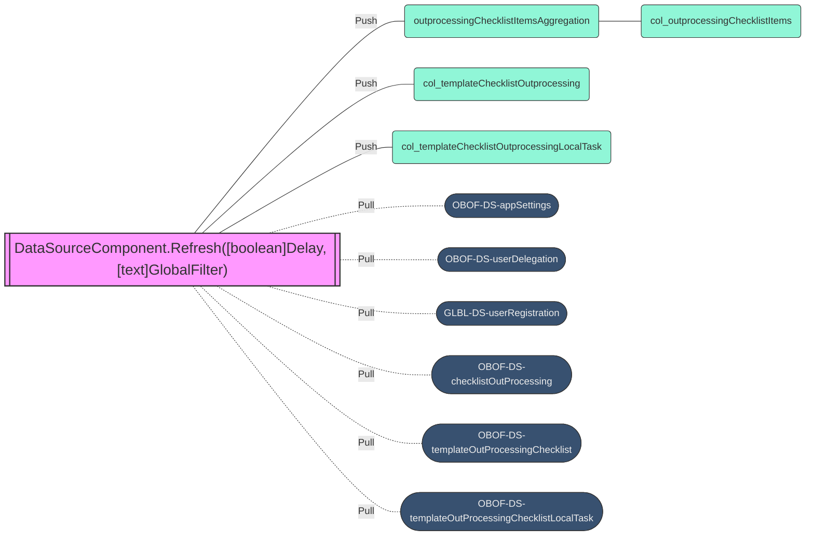
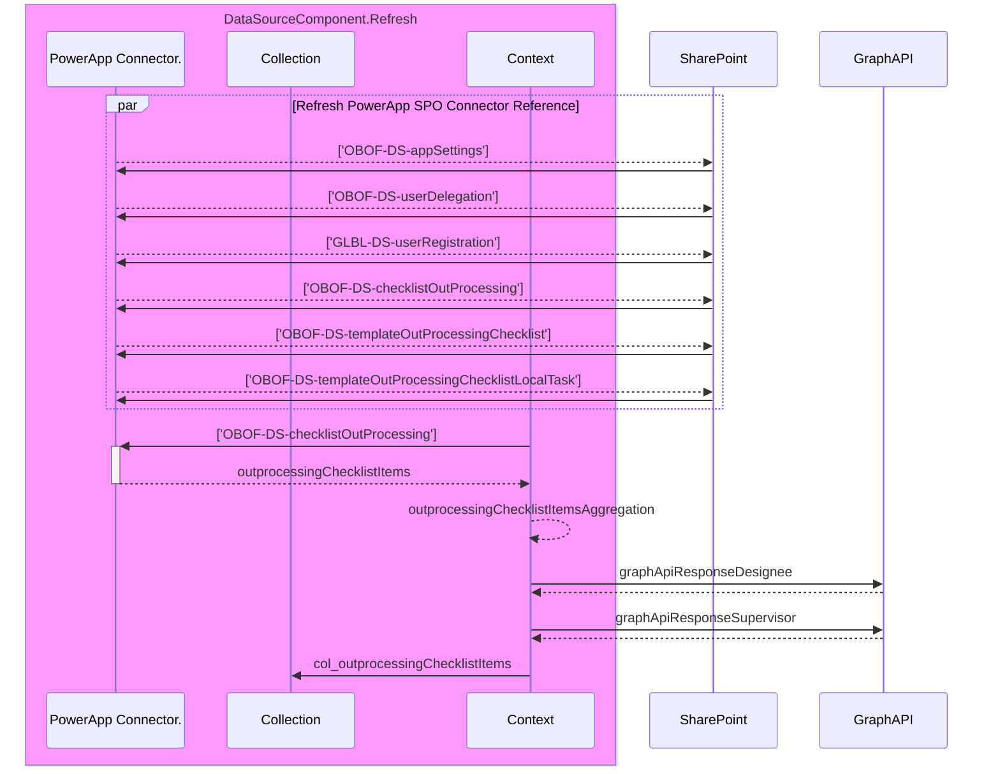
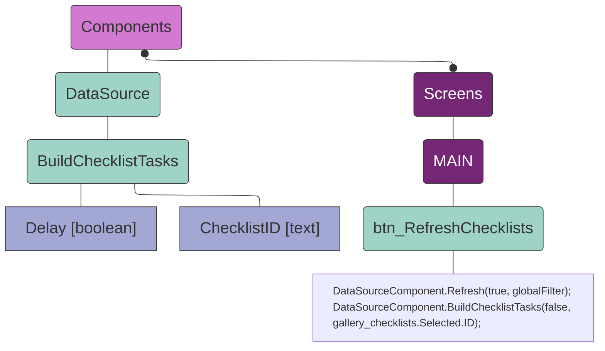
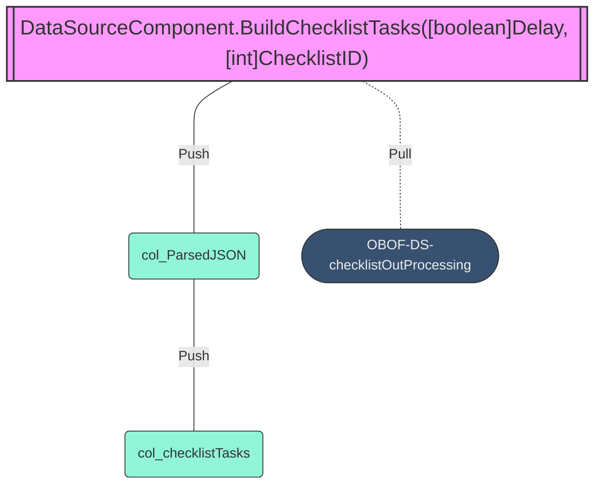
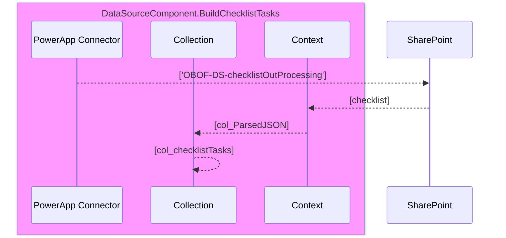

[[_TOC_]]

# 1.0.0 - DCMA Enterprise Profile

DCMA Enterprise Profile's create persistent storage of information related to each user that logs into a system that has integrated the enterprise profile feature eliminating requirements and additional development efforts to obtain common metadata about an employee. Leveraging common data relationships about personnel within an enterprise profile increases information integrity and reduces duplicative processes. Enterprise Profile common data sources are pulled from DoD365-J Microsoft Entra ID and IWAM through Graph API/REST API endpoints and DCMA data gateways.

## 1.1.0 - Enterprise Profile | Graph API

Microsoft Graph API queries pull information direct and relational data about the current user logged into the application. All Graph API calls leverage delegated access through federated OAuth v2.0 access controls.

# 2.0.0 - Application Portal

All users of the Out-Processing/Transfers Checklist will land on the Application Portal where personnel can create new checklists or continue working to complete existing checklists. The Application Portal is subdivided into **four** (4) primary areas.


- **\[1\] Category Menu**
  - Used to navigate between each respective category: Departing Employee, Supervisor/Designee, Clearing Offices, Mission Support, Completion Signatures
- **\[2\] Main Menu**
  - Create _New Checklist_
  - Create _Local Task_
  - Create _Comments_
  - Execute _Refresh Checklists_
  - View overall checklist progress percentage
  - View individual checklist progress percentage
  - Filter checklists by: Checklist ID, Employee Name, Organization Code, Out-Processing Status
  - Show checklists that are in progress or completed
  - View summary information for selected checklist
- **\[3\] Departing Employee Checklists**
  - Lists all visible checklists available to the authenticated user
- **\[4\] Departing Employee Checklist Tasks**
  - Lists all tasks to be completed for the selected checklist

> The Application Portal can be used to switch between multiple checklists and complete tasks assigned to an individual. The four (4) primary areas of the Application Portal are used to help increase visibility and task completion effectiveness.

## 2.1.0 - Category Menu

The Category Menu is used to view checklist tasks by predefined groups. Each predefined group in the Category Menu is divided by [roles](#roles) assigned to users within the application. Most tasks for a given role can be found within each group of the Category menu.

## 2.2.0 - Main Menu

##### 2.2.1 - **New Checklist**

New Checklists for an individual employee or [delegated](#delegation) employee can be created using the _New Checklist_ button.

##### 2.2.2 - **Local Task**

Users with the appropriate security roles can create or assign a local task to a selected checklist using the _Local Task_ button. Reviewing or adding comments to a selected checklist can be done using the _Comments_ button.

##### 2.2.3 - **Refresh Checklists**

In the event Checklists or Checklist Tasks do not load correctly the _Refresh Checklists_ button can be used to refresh all data sources and entities.

Selecting the **Refresh Checklists** button on the Main Menu will call these two functions. See [Functions & Triggers](#300-functions-triggers) for details on the functions listed below.

```typescript
DataSourceComponent.Refresh(true, globalFilter);
DataSourceComponent.BuildChecklistTasks(false, gallery_checklists.Selected.ID);
```

##### 2.2.4 - **Checklist Progress**

Checklist Progress gives a visual representation of the overall completion percentage for a selected Checklist. The smaller pill shaped percentages below the Checklist Progress show independent completion percentages for each respective category: Departing Employee, Supervisor/Designee, Clearing Offices, Mission Support, and Completion Signatures.


Checklist Progress is calculated by counting the number of rows in the checklist task data object that have the `.IsCompleted` property equal to `true` divided by the total number of checklist tasks multiplied by 100. If the checklist tasks data object is empty, then the checklist progress is equal to 0. The `!IsEmpty` will determine if the checklist task data object is **not** empty. When the data object is **not** empty then the checklist progress is calculated.

```typescript
If(!IsEmpty(col_checklistTasks),
    Round((CountRows(Filter(col_checklistTasks, isCompleted = true)) / CountRows(col_checklistTasks) * 100), 0),
    0
)
```

##### 2.2.5 - **Filter By**

Checklists can be filtered by Checklist ID, Employee Name, Organization Code, and Out-Processing Status making it easier to find a specific checklist when users have visibility to multiple checklists based on a given security role. By default, checklists that are currently in progress are shown but can be changed using the two (2) toggle buttons located next to the filter. Summary information about a selected checklist is displayed in the right side of the Main Menu.

## 2.3.0 - Departing Employee Checklists

Personnel checklists are shown here as [Checklist Cards](#checklist-card) in the left half portion of the Application Portal. Security roles and tagging determine the number of checklist cards shown. Tagging is achieved by associating a user's profile to the Supervisor or Designee field within a checklist card. Personnel who submit their own checklist will automatically have the Supervisor associated with their DCMA Enterprise Profile tagged as the Supervisor and Designee. Only a tagged supervisor can update the [Designee](#designee) with a new tagged user profile.

### 2.3.1 - Checklist Card

- Display Name - Name of departing personnel
- Checklist ID - Unique ID for each individual checklist labeled as CHKID
- Created Date - Timestamp when checklist was created/submitted
- Departure Date - Anticipated timestamp of departure (last duty day)
- Days Until Departure - Dynamically calculated number of business days remaining to complete checklist
- Organization - Agency Organization label configured by DCMA Enterprise Profile
- Organization Code - Agency Organization Code label configured by DCMA Enterprise Profile
- Designee - User identified to complete Supervisor/Designee signature blocks
- Supervisor - User identified to complete Supervisor/Designee signature blocks and administer changes to checklist card
- Checklist State - Current state of checklist (In Progress, Completed)
- Checklist Status - Type of out processing/transfer (Transfer | PCS Other Federal Service, Transfer | PCS Intra-Agency, Retirement, Resignation | Separation, Other _Deceased/Termination/Walkaways_)

Each checklist is represented as checklist card under **Departing Employee Checklists**. Each checklist card contains all assigned checklist tasks that are to be completed before the checklist card is considered completed. By default, all newly created checklists for both individual and delegation are considered in progress until all tasks have been signed.


Checklist cards show the departing personnel's display name at the top followed by summary information about the checklist and personnel along with the Checklist ID. In certain cases, the checklist card may display the following badges or icons:

-  Checklists that are opened on-behalf-of personnel in their absence
-  Abbreviated alert indicating the checklist has a limited number of days remaining before the designated departure date
- Indicates the checklist has comments - if the comments icon is not visible then no comments have been made on that checklist
-  Indicates the checklist has new/unread comments - after reviewing comments the red dot indicator will no longer be visible

## 2.4.0 - Departing Employee Checklist Tasks

Checklist tasks show the departing personnel's out-processing/transfer actions to be completed prior to a Transfer | PCS Other Federal Service, Transfer | PCS Intra-Agency, Retirement, Resignation | Separation, or Other _Deceased/Termination/Walkaways_. All tasks must have all required signature blocks signed before any given checklist will be marked as completed.

### 2.4.1 - Checklist Task

- Task ID - Identification defined by checklist template (_Will always reflect the same ID in template_)
- Task Title - Title defined by checklist template (_Will always reflect the same Title in template_)
- Due in Days / Timestamp - Dynamically calculated business days to complete individual task from created timestamp minus departure timestamp; displayed as integer for days along with date format below
- Days Remaining - Dynamically calculated business days remaining until as task is due; value is calculated each time the DOM (Document Object Model) is loaded
- Task Details - Details defined by checklist template (_Will always reflect the same Details in template_)
- Extended Attributes - Field typically defined in _Clearing Offices_ category to display custom extended attributes such as OGE 450 Filer and Litigation; See [Extended Attributes](#extended_attributes) and [JSON Schema](#json_schema) for more information
- Service Request - Field typically defined in _Clearing Offices_ category to display input components to record the service request ticket number related to a task; See [Service Request](#service_request) for more information
- Send Notification - Component used to send email notification to a specific person or group of person(s) with custom defined email template
- Departing Employee Signature - Signature block for personnel to mark task as completed
- Supervisor / Designee Signature - Signature block for Supervisor / Designee to mark as completed
- Supervisor Signature - Signature block for Supervisor to mark as completed (_The use of a single Supervisor signature is not typically used_)
- Designee Supervisor - Signature block for Designee to mark as completed (_The use of a single Designee signature is not typically used_)
- Clearing Office Signature - Signature block for Clearing Office official to mark task as completed
- Mission Support Signature - Signature block for Mission Support official to mark task as completed

# 3.0.0 - Functions & Components

Functions are "self contained" modules of code that accomplish a specific task. Functions usually "take in" data, process it, and "return" a result. Once a function is written, it can be used over and over and over again. Functions can be "called" from the inside of other functions.\
Event Triggers can be attributed to when something happens in a app. For example: a control is selected, a control has changed value, a screen has become visible, or a screen has become hidden. These are known as Event Triggers and Event Properties allow us to attribute code to these events.

## 3.x.0 - **Component** App.OnStart()

This componet executes the `OnStart()` event trigger when the application loads. During the `OnStart()` execution, all required data sources, caollections, and variables needed to being using the application are initiated.

- **Attributes**
  - **Location:** Screens
  - **Screen**: App
  - **Component Name:** App
  - **Component Type:** Application
  - **Component Properties**
    - **Name:** OnStart
    - **Property Type:** Event
    - **Retrun Data Type:** *N|A*



> **Component Definition**\
> `App.OnStart()`

This critical component initiates all required data source connectors along with collection tables and variable initialization. If any data connectors fail during this initial load it may cause multiple other areas to fail, or cause the application to not load. The following SharePoint Lists are considered critical during to initiate during the `OnStart` trigger: 'OBOF-DS-appSettings', 'OBOF-DS-userDelegation', 'GLBL-DS-userRegistration', 'OBOF-DS-checklistOutProcessing', 'OBOF-DS-templateOutProcessingChecklist', and 'OBOF-DS-templateOutProcessingChecklistLocalTask'. During startup a global variable named `appMetadata` is configured with values identifying properties specific to each enviornment: appMetadata.appUid, appMetadata.appName, appMetadata.appVwersion, appMetadata.appEnvironment, appMetadata.appPublisher, appMetadata.appPrefix, appMetadata.appUrl. The two properties from `appMetadata` that are critical for the operation of the application are appMetadata.appUid and appMetadata.appUrl. The appMetadata.appUid sets the application id relative to the enviornment,each environment will have to distinct id. The appMetadata.appUrl is passed when an email notification method is called where it is used in the embedded **LAUNCH APPLICATION** button. 

> **Component Dependency**\
> `App.OnStart()`

> **Function Processes**\
> `App.OnStart()`

## 3.x.0 - **Function:** DataSourceComponent.Refresh()

This function is used to refresh all critical data sources and build some critical data collections.

- **Attributes**
  - **Location:** Components
  - **Screen**: *N|A*
  - **Component Name:** DataSource
  - **Component Type:** Custom Component
  - **Component Properties**
    - **Name:** Refresh
    - **Property Type:** Action
    - **Retrun Data Type:** `boolean`
    - **Parameters**
      - **Name:** Delay
      - **Data Type:** `boolean`
      - **Required:** `true`
      - **Name:** GlobalFilter
      - **Data Type:** `text`
      - **Required:** `true`



> **Function Definition**\
> `DataSourceComponent.Refresh([boolean]Delay, [text]GlobalFilter)`

This function takes two input values, `Delay` and `GlobalFilter`, to build all Tables and Typed Objects for App Settings, User Delegation, User Registration, Checklist Out-Processing, Template Out-Processing Checklist, Template Out-Processing Checklist Local Task. The `Delay` input value is a boolean that tells the function to enable or disable the `isBuildChecklistTasksRunning` variable that displays a loading animation of four circling boxes. When this value is `true` the loading animation will continue to display until another function is called to disable the animation display. The `GlobalFilter` must have a value of 'In Progress' or 'Completed'. This value tells the refresh function to display only checklists that are either in a status of 'In Progress' or 'Completed'. Below is the function code that runs when called and input parameters are satisfied.

The input parameter `Delay` is satisfied in the following code block specifying whether the loading animation continues/stops.

```typescript
If(!Delay,
    Set(isBuildChecklistTasksRunning, false);,
    true
);
```

The input parameter `GlobalFilter` is satisfied in the following code block specifying whether checklists with a status of 'In Progress' or 'Completed' are displayed in the Departing Employee Checklists menu.

```typescript
Filter('OBOF-DS-checklistOutProcessing',outprocessingState.Value = GlobalFilter),
```

> **Function Dependency**\
> `DataSourceComponent.Refresh([boolean]Delay, [text]GlobalFilter)`



> **Function Processes**\
> `DataSourceComponent.Refresh([boolean]Delay, [text]GlobalFilter)`



## 3.x.0 - **Function:** DataSourceComponent.BuildChecklistTasks()

This function is used to build the Checklist Tasks from JSON received into a typed object collection. All checklist tasks are stored in a SharePoint List as raw JSON. In order to perform any CRUD operations on the JSON data it must be converted into a collection each prior. 


- **Attributes**
  - **Location:** Components
  - **Screen**: *N|A*
  - **Component Name:** DataSource
  - **Component Type:** Custom Component
  - **Component Properties**
    - **Name:** BuildChecklistTasks
    - **Property Type:** Action
    - **Retrun Data Type:** `boolean`
    - **Parameters**
      - **Name:** Delay
      - **Data Type:** `boolean`
      - **Required:** `true`
      - **Name:** ChecklistID
      - **Data Type:** `number`
      - **Required:** `true`



> **Function Definition**\
> `DataSourceComponent.BuildChecklistTasks([boolean]Delay, [int]ChecklistID)`

This function takes two input values, `Delay` and `ChecklistID`, to build all Tables and Typed Objects for Checklist Out-Processing. The `Delay` input value is a boolean that tells the function to enable or disable the `isBuildChecklistTasksRunning` variable that displays a loading animation of four circling boxes. When this value is `true` the loading animation will continue to display until another function is called to disable the animation display. The `ChecklistID` must have an integer value used to query for the ID of a given Checklist. When the query completes the returned values will contain all the necessary information required to build (convert) the checklist from raw JSON.

> **Function Dependency**\
> `DataSourceComponent.BuildChecklistTasks([boolean]Delay, [int]ChecklistID)`



> **Function Processes**\
> `DataSourceComponent.BuildChecklistTasks([boolean]Delay, [int]ChecklistID)`



This function is typically called after the `DataSourceComponent.Refresh()` which builds the `Typed Objects` from the JSON received.

# 4.0.0 - Access

Access to the Out-Processing and Transfers Checklist application is granted to all DCMA personnel by a dynamic security group ensuring only members of the DCMA tenant can view or execute actions. Other rights/permissions are granted by separate security groups depending on the users position or function. Membership to other rights/permissions by security groups is a manual process that requires approval from Total Force.

## 4.1.0 - Roles

Roles determine the user's rights and permissions within the application and are assigned using Power Platform Security Groups. Each role comes with its own set of permissions and capabilities. In special cases, some roles can be applied through inheritance via tagging a user's persona to an individual data set. These special cases are explained in more detail later.

- **Total Force Manager** - Administrative role across entire application to manage and maintain the functionality and execution of checklist tasks
  - Title: <kbd>DCMA-OBOF-TF-Manager</kbd>
  - Permissions: <kbd>CRUD</kbd>
  - Security Identifier: <kbd>1da947cd-5076-4f3d-9dff-cb2b592fc6f4</kbd>
  - Users in this group can create/update local tasks in repository
  - Users in this group can add/remove users from security groups
  - Users in this group can delete checklists
  - Users in this groups can update specific details on checklists
  - Users in this group can update specific information related to a delegated user's profile
  - Users in this group can run analytical reports
  - Users in this group can sign any signature block for checklists where they are not the Departing Employee
- **Total Force Program Manager** - View all checklists
  - Title: <kbd>DCMA-OBOF-TF-ProgramManager</kbd>
  - Permissions: <kbd>R</kbd>
  - Security Identifier: <kbd>f9007a58-7e42-47e4-be8a-e1f7a5bdedbf</kbd>
  - Users in this group can view all checklists but not sign any signature block
- **Supervisor** - Administer local tasks, sign Supervisor signature block for specific tasks, and makes limited changes to personnel checklists provided by tagging
  - Title: <kbd>DCMA-OBOF-Supervisors</kbd>
  - Permissions: <kbd>Limited CRUD</kbd>
  - Security Identifier: <kbd>f835aab1-1d5e-4f3b-8c6f-c3a507f28816</kbd>
  - Users in this group can only sign the Supervisor/Designee, Supervisor, or Designee signature block for checklists where they are not the Departing Employee
  - Users in this group can update specific information related to a delegated user's profile
- **MSO** - View all checklists and sign Mission Support signature block for specific tasks
  - Title: <kbd>DCMA-OBOF-MSO</kbd>
  - Permissions: <kbd>Limited RU</kbd>
  - Security Identifier: <kbd>cda3c21d-79fb-4bf8-9a2f-d714f21b7687</kbd>
  - Users in this group can only sign the Mission Support signature block for checklists where they are not the Departing Employee
- **Clearing Office** - View all checklists and sign Clearing Office signature for specific tasks
  - Title: <kbd>DCMA-OBOF-MandatoryClearingOffices</kbd>
  - Permissions: <kbd>Limited RU</kbd>
  - Security Identifier: <kbd>ccf5494b-34e0-4f94-861a-602056dd96bc</kbd>
  - Users in this group can only sign the Clearing Office signature block for checklists where they are not the Departing Employee
- **Member** - Dynamic Security Group that gives all DCMA personnel view/create access to checklists and sign Departing Employee signature block for specific tasks
  - Title: <kbd>DySG-DCMA-All</kbd>
  - Permissions: <kbd>Limited RU</kbd>
  - Security Identifier: <kbd>5063ca52-933a-41f6-9f5f-d95b5c1ea427</kbd>
  - Users in this group can only sign the Departing Employee signature block for checklists they have created or checklists that were created on-behalf of the user via delegation
  - Users in this group can update specific fields related to their DCMA Enterprise Profile only

## 4.2.0 - Inheritance / Tagging

Inheritance or Tagging is achieved in a few of different ways: \[1\] when personnel first configure their DCMA Enterprise Profile (DEP), \[2\] when personnel update their DEP, \[3\] or when a checklist is created using delegation.

- \[1\] When personnel initially configure their DEP, they are asked to provide a current Supervisor. The Supervisor linked to the personnel's DEP is used whenever a checklist is created by the Departing Employee (personnel).
- \[2\] When a user updates their DEP, all checklist(s) tagging will be updated with the new Supervisor associated with the Departing Personnel's DEP.
- \[3\]

# Delegation

# Extended Attributes

# Service Request
